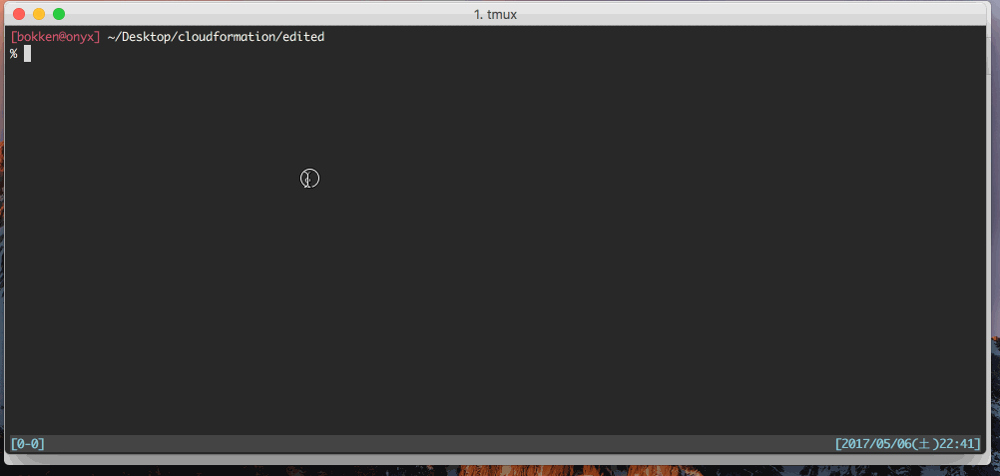

# AWS Browse command

This tool offers you to easy access to Amazon Web Services console.

## Demo



## Usage

* Move to aws console of specified service
    ```sh
    $ awsb <service> [region (default: us-west-2)]
    ```
* Or specify `--service` and `--region`
    ```sh
    $ awsb --service <service> --region <region>
    ```

* Show list of services
    ```sh
    $ awsb --service-list

    s3
    lambda
    logs
    dynamodb
    ...
    ```

* Show list of regions
    ```sh
    $ awsb --region-list

    us-east-1:  N. Virginia
    us-east-2:  Ohio
    us-west-1:  N. California
    us-west-2:  Oregon
    ...
    ```

## Options

| Option               | explanation        |
|:--------------------:|:------------------:|
| --service            | to specify service (default: s3) |
| --region             | to specify region  (default: us-west-2) |
| --service-list (-S)  | list of services   |
| --region-list  (-R)  | list of regions    |

## Install

```sh
go get -u github.com/negibokken/awsb
```

## License
MIT
